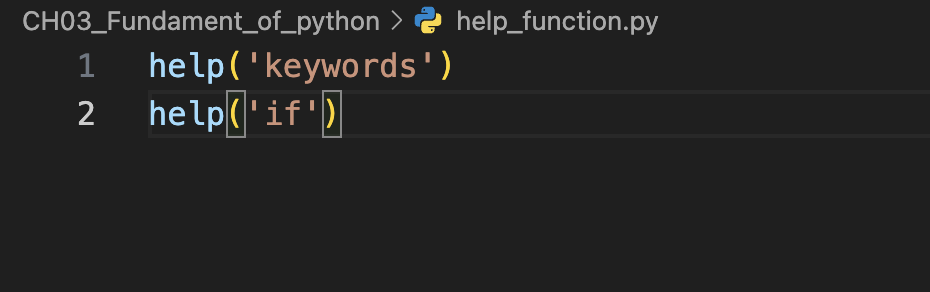
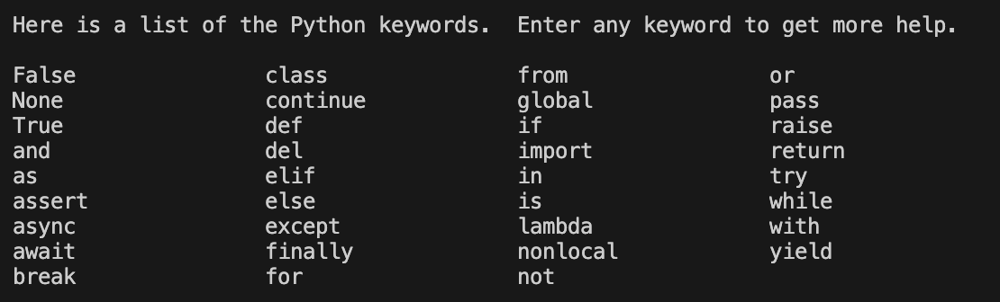
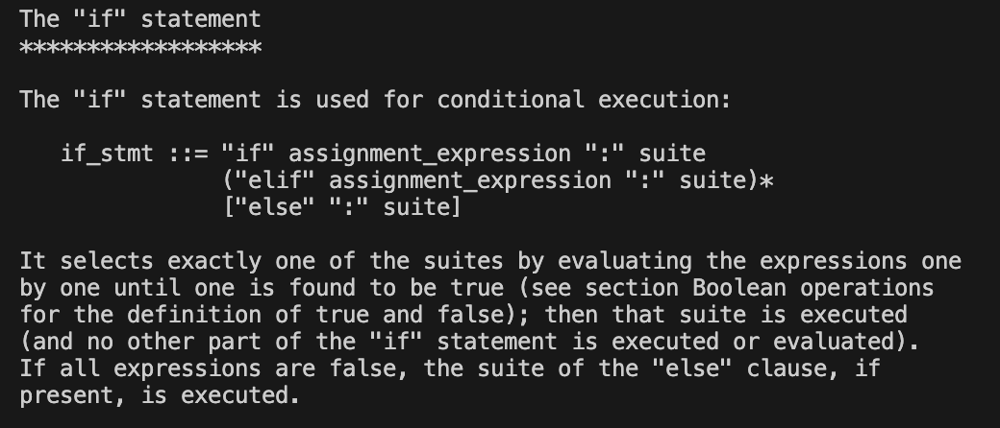
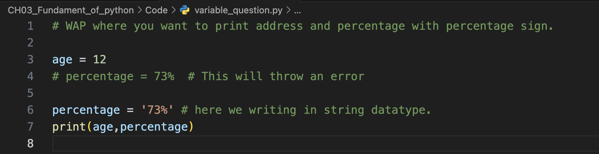
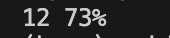
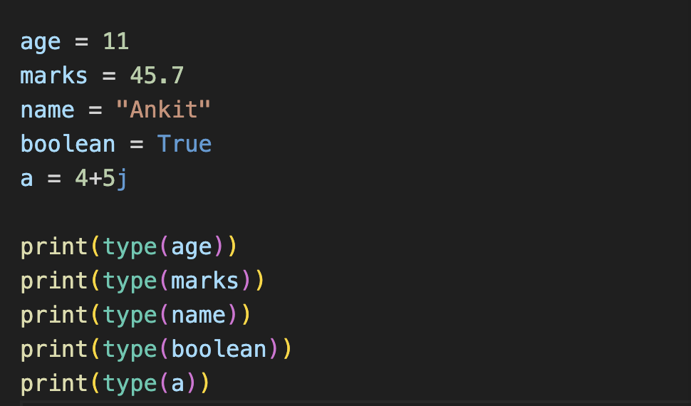
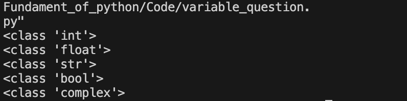
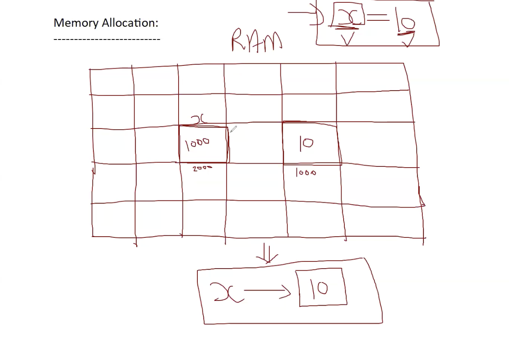
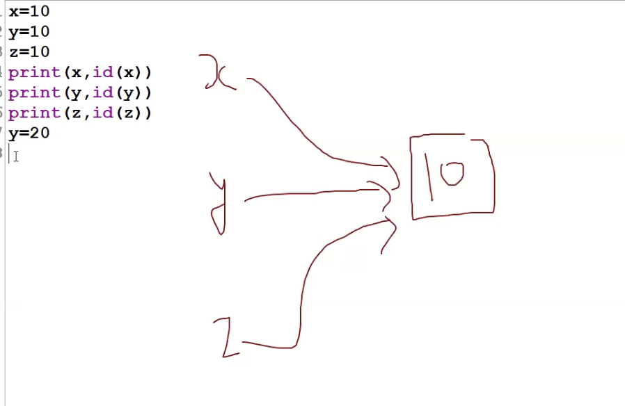

# Chapter 3 : Python Language Fundamentals 

1. Keywords
2. Comment
3. Variables
4. Operators
5. Type Conversion
6. User Input 
7. Condition statements
8. Looping Statement 
9. String Handling
10. Container Datatypes

 
## 1.   Keywords : 
- keywords are reserve words having specific meaning.
- we can not change/modify their meanings.
- There are 35 keywords in python 3.13.2 version.
- 32 are in lowercase and 3 are in capitalize case. (True,False,None)

```
abc ---> lower case
ABC ---> upper case
Abc ---> capitalize case 
```
- help() function may be used to get list of available keywords in current version.

> help('keywords')

- We may also get meaning of a specific keyword using following syntax : 
    * help('if')
    * help('else)
    * help('for')
    etc.
```
Code: 
       help('keywods')

output: 
```
### Example :





 ## 2. Comment 

- It is non-executable part of program.
- Generally, we use comment to make the code more readable to developers.
- python supports only sigle line comment , represented by #

## 2. Literal:
 - it is a value that is known while defining code.
 - there  may be different types of literal like:
    * int literal ---> 10,20,0,-7
    * float literal -> 4.5,-5.6
    * str literal ---> '..',"...",'''......''',"""......"""
    * bool literal ---> True , False
    * NoneType literal ---> None
    etc.

## 3. Variable

- A variable is a temporary storage(valid/available till program execution) for values.
- A variable also provide identity to a value.

`syntax:  variable_name = value`
```
age = 20 
name = "sonu"
marks=56.8```
```
```
roll = 12
print(roll)

output: 12
```

 ## Variable Rules

- only underscore is allowed and other symbols are not allowed.
` eg. date_of_birth`
- It is case sensitive , means age & Age are different variable.
- Digits are allowed but not as first char.
``` 
eg.  age1 = 13    # correct
     2age = 21    # throw an error
```
- Keywords can not be used as variable names.
- According to python in variable we need min char=1 and max char = n

### Question: 



> NOTE: 
``` 
There are two type of variable in coding world:

1. Statically typed : the coding language which follow rule that first you have to declare variable data type. eg. C,C++,Java

2. Dynamically typed : the coding langugae which follow rule that we do not need to declare variable data type.
```
> NOTE: 

- Python is a dynamically typed language, i.e we need not to define explicit datatype of a variable and it is done by interpreter itself during execution.
- C/C++/Java are statically typed languages.

``` exp: 
            int age = 20 (statically typed)
            age = 20 (Dynamically typed)
```
- dynamically typed languages are generally slower than statically typed.

### type() function
- type() function can be used to get datatype of a variable.
    - Syntax:
                > datatype=type(variable)

- we may also call type() with print()
    
    - print(type(variable))




## Variable Memory Management 



- From memory point of view , a variable is a name block that refers to another block where value is actually stored.
- in short, a variable is reference to a value. 
- int/float/str/bool values are immutable (unmodifiable) because they may be shared to multiple references.

- if you modify these values , a different memory block is allocated.


### id() Function: 
- > id() function returns address of a value

``` 
address = id(value)
        or
address = id(variable) # returns address of value referd by variable.
```


> Note: <br>
```
 If you never want to modify a variable then you should write in caps like:
DOB =2000
```
