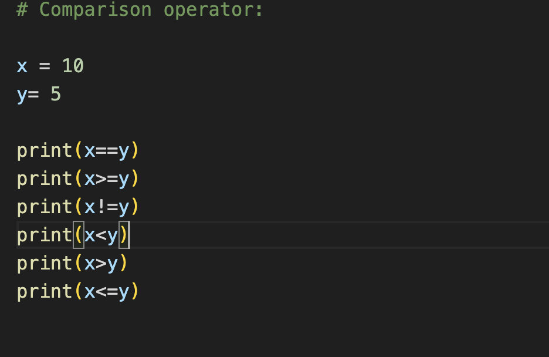
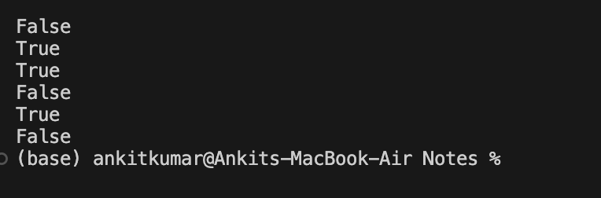
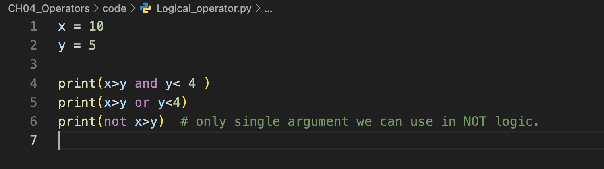
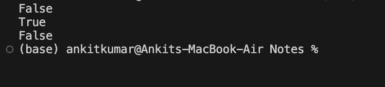

# Chapter: Operators In Python

-  Operatores perform mathematical, comparision , logical , searching , and others operations on operands.
- operand representd by  value/variable/expression
- operator represented by symbols and keywords
```
Example :  2 + 3 

# here 2 and 3 are operands.
#  ' + ' is operator.
```

## Types Of Operators : 
1. Arithmetic Operators 
2. Assignment Operators
3. Comparision (Relational) operators
4. Logical Operators
5. Bitwise Operators
6. Del Operator
7. Membership operator
8. Identity Operator
9. Ternary Operator

etc => it can be update in future or they can made.

### 1. Arithmetic Operators: 

a. addition (+)  <br>
b. substraction (-) <br>
c. product/multiply (*) <br>
d. true division (/) <br>
e. floor division (//) <br>
f. modulo/ remainder division (%) <br>
g. exponent/power (**)<br>


### Expression : 
- Any statement that produces result is known as expression.
- it may or may not use operators.
- <mark>if it uses arithemtic operators then evaluation is done according to **precedence and associativity.**</mark>


### Quesiton :

```
i. print(5+5*5)
ii. print(5+5)*5
iii. print(10-2**3*2)
iv. print(100-2**3**2)
v. print(20/5*2)
```
### 2. Assignment Operators :

a. Assignmet : 
- it is used to assign a value to a variable .
- syntax =>
> variable = value/variable/expression.


> Note : it has least priority than other operator.

b. Chained Assignment: 

```
syntax :
    var1=var2=var3......= value
```
c. Compound Assignment: 
- combination of arithmetic and assignment operator.

```
1. var+= value      # var = var+value
2. var-= value      # var= var-value
3. var*=value       # var = var * value
4. var/=value       #     
```

> Note: Python Does not have Increment (a++) and Decrement (a--) operators.

d. Walrus Assignment : 
- it was added in 3.8 version to define and use a variable within expression.

- syntax:
> var:=value

```
exp: 
        physic = 8 # out of 10
        maths = 9
        # if we wan't to store the sum of 2 subject btw equation so: 
        avg=(s:=p+m)/2
        print(avg)
        print(s)
```
## 3. Comparision / Relational Operators:

- return boolean Result (True / False)

1. equal comparision (==)
2. not equal comparison (!= )
3. Greater Comparison (>)
4. Less comparison (<)
5. Greater or equal comparison (>=)
6. Lesser or equal comparison (<=)




## 4. Logical Operator :

- return boolean result (True/ False)
- Generally, we use logical operators to combine results of multiple comparisions.
- Represented by following keywords: 

a. Logical AND (and) <br>
b. Logical OR (or)  <br>
c. Logical NOT (not) <br>

### Truth Table for (and):
- True and True == True
- True and False == False
- False and False == False
- False and True == False

### Truth table for (or):

- True or True == True
- True or False == True
- False or False == Flase
- False or True == True

### Truth table for (not): 

- not Truth == False
- not False == Truth

Example : 



## 4 .Bitwise Operators : 

- works with bits of int values.
- return int result.

a. Bitwise and (&) {mpercent} <br>
b. Bitwise or (|) {pipe} <br>
c. Bitwise xor (^) {exclusie or} <br>
d. Bitwise leftshigt (<<)<br>
e. Bitwise rightshift(>>)<br>
etc.

### Truth table for  bitwise and(&)

- 1&1 == 1
- 1&0 == 0
- 0&1 == 0
- 0&0 == 0 

### Truth table for bitwise or (||)

- 1 || 1 == 1
- 1 || 0 == 1
- 0 || 0 == 0
- 0 || 1 == 1

### Truth table for bitwise xor(^):

- 1 ^ 1 == 0
- 1 ^ 0 == 1
- 0 ^ 0 == 1
- 0 ^ 1 == 0

### Bitwise leftshift : 

a << b ==> shifts bits of a by b times to left.<br>
trick => a will double in 1 left shift.

### Bitwise rightshift:
a>>b ==> shift bits of a by b timesa to right.<br>
trick ==> a will be floor divided by 2 in right shift.


### Application of bitwise operators:

- Signal processing (embedded system, IOT programming)
- set operations (union, intersection etc)
- numpy , pandas lib. etc.


## 5. Del operator :
- It is used to free the memory of a variable and make this variable unusavle in further statements of programs.

- syntax :
` del variable_name `

- example : 
```
a = 10 
print(a)
del (a)
print(a)  # Throw an error
```
> Note:  We can not use del with literals.<br>
Example:  del 10    # throw error

## 6. Ternary operator: 
- It is also known as conditional operator.
- It is defined using if else statement in a single statement.
- syntax: <br>

` true_expression if bool_expression else false_expression`

Example : 


