# Function In Python 

> Note: The working of Loops and Function look similar but Function is used for reuseability and Loops is used for repeatation.

### Function : 
- A function is a named block that provides reusability of logic anywhere in same or other programs.
- There are 2 parts of a function:
1. function definition ---> we define logic
2. function calling ---> we execute function

### syntax for function definition: 

```
def function_name():
        logic
```
### syntax for function calling:

` function_name() `

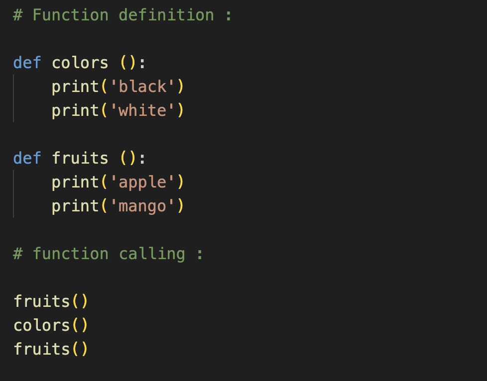
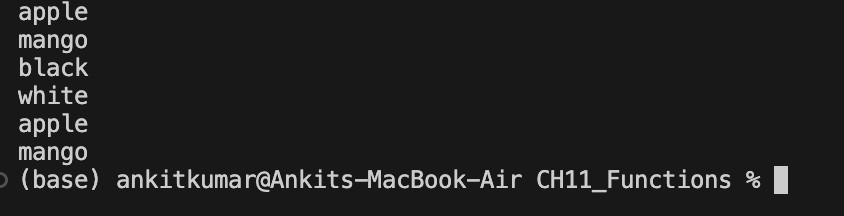

## Keypoints: 
- first we need to define a function then only we can call it.
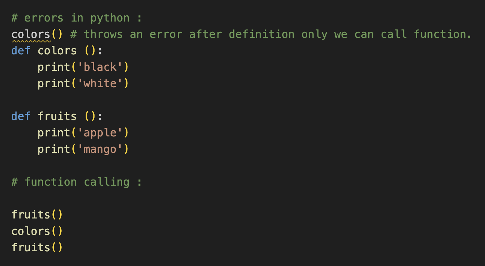
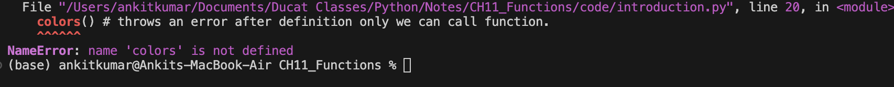
- function_name follows same rules as variable name.
- if same function is defined multiple times then only latest definition is executed.

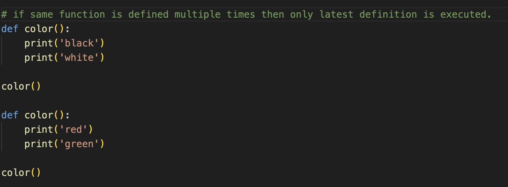
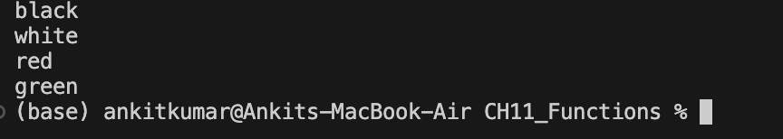

## Types of definition:
1. Pre - defined: by language
        exp: <br>print(), len(), min(), max(), sorted() etc.
2. Custom: by programmer 
        <br>exp: trasfer_amount(),user_login(), etc.

## Local & Global Variable:

### Local Variables:
- A variable is said to be local if it is defined inside function block.


- It can be used to function block only not outside.
- It gets the memory for each call and destroyed when call completes.

### Global Variables:
- A variable is said to global if it is defined at program level.


- It can be used by further statements of program.
- It gets the memory only once when encountered in program and destroyed when program completes.

> Note: If we define a local variable with same name as global then inside that function priority goes to local. 

>if we want to define global variable from function then we have to use 'globla' keyword.


### Question: 


### Question : 


## Parameters And Arguments

# Parameters:
- It is a variable that we define inside function()
- It is generally used to take value from caller.
- example:

```   
        def fun(a,b)      ## a, b are parameters
            code 
```
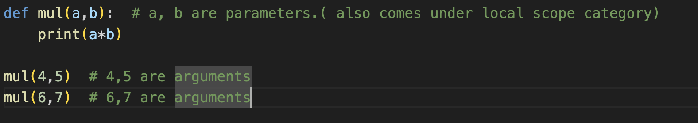
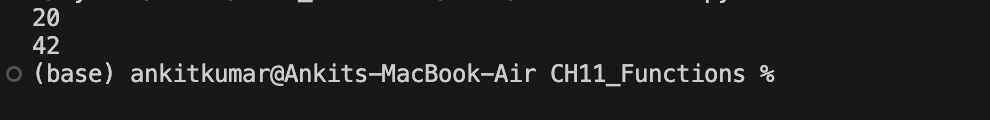

### Arguments:
- It can be a value or expression or variable that we pass to parameter at the time of function call.
- exp : 


`   fun(10,20)          # 10 ,20 are argument.  `
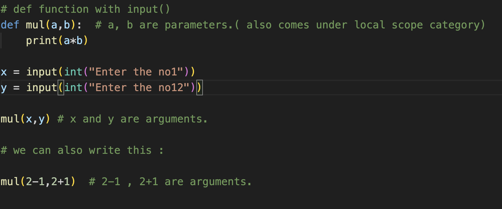
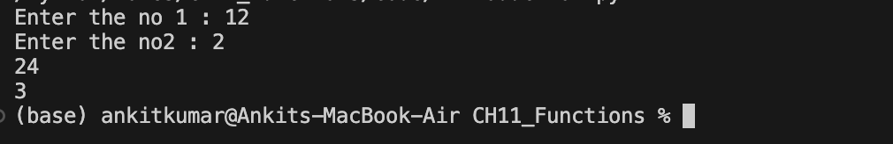

> Notes: we need to pass same number of arguments as number of parameters.

```
Parameters                          Arguments

1. Only variable                1. variable/value/expression
2. can't be duplicate           2. duplicate arguments are allowed.

```


### Questions: 
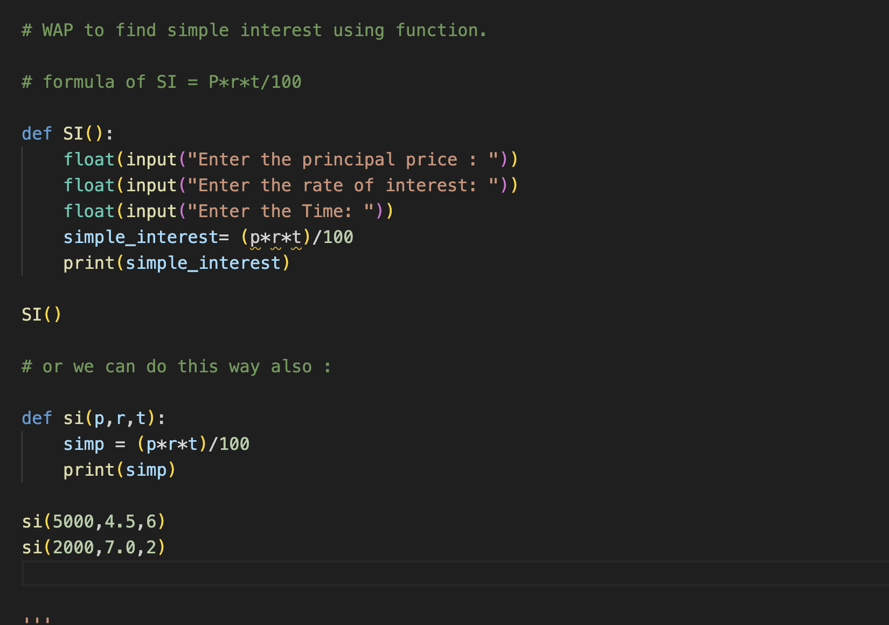


### Questions:
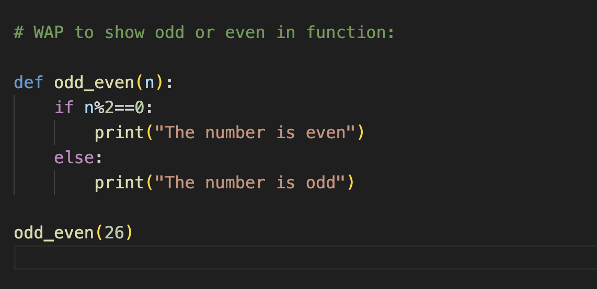


## Types of Arguments:

1. Positional Arguments
2. Kwyword Arguments
3. Default Arguments
4. Arbitrary ( Variable length) Position Arguments
5. Arbitarary (variable length) Keywords Arguments

1. **Positional Arguments:** 
- It is the default approavh used in python to pass argument.
- We pass argument based on their postions to the parameters, it means first argument is for first parameters and 2nd argument is for 2nd parameter and so on .

```
exp:
                def fun(a,b)
                        logic
                
                fun(10,20)   # Positional Argument.
```
2. **Keyword Arguments:**
- In this approach, we pass argument by using name of parameters and order (position) of parameters does not matter.

```
exp: 
        def fun(a,b):
                logic
        
        fun(a=10,b=20)  # keyword Argument
        fun(b=20,a=10)  # position does not matter.
```
**Rules:**
- name of keyword argument must be same as name of parameters.
- we can not repeat keyword arguments
- we may mix both positional and keyword byt first we have to pass positonal then keyword arguments . 


3. **Defualt Arguments:**
- In this approach , we assign argument to parameters in definition.
- These arguments are used when we do not pass arguments to parameters in fun call.

```
exp: 
        def fun (a= 10,b=20):           # default arguments
                logic 
        
        fun()
        fun(1)
        fun(1,3)
        fun(b=5)
```
**Rules:**
- First we define parameters without defult then parameters with default.

```
example : 
                def fun(a,b=20):   # correct
                def fun(b=20,a):   # error
```


4. **Arbitrary (variable length) Positional Argument : ***
- It can accept 0 to N positional arguments.
- It behaves like a tuple.

> Use this when you don't know how many arguments are going to given by user:
```
syntax: 
        def show(*argument):
                code
        
        show()
        show(10,20)
        show(10,20,30)
        show (10,20,30....,N)
```
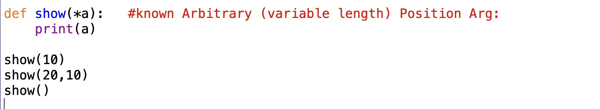
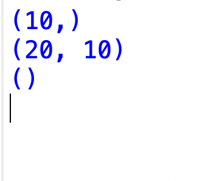

> Note: The default output is tuple but we also convert it into list, dict by pass return in list/dict/tuple

5. **Arbitrary (variable length) Keyword argument:**
- It can accept 0 to N keyword arguments.
- It behaves like a dict.

```
syntax: 
        def show(**arguments):
                code

        show()
        show(a=10,b=12)
        show(a=10,b=12,c=13)
```
## Retune in Function:

> In place of global we can also use 'return'.

> we can use return if we want our local value/ result outside the program.


### User cases of return:
1.
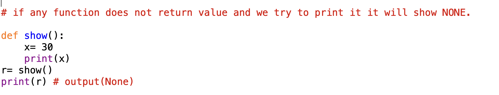


2.


### Note: In Function :
```
3 Condition can be comes with return:
i. it will return nothing.
ii. it will return one value.
iii. it will return multiple values.
```
### Question : 

```
def add(a,b):
        print(a,b)

add(10,20)

# How user decide which type of value we have to enter and if in the place of int we put float is that also run or throw error:

Ans. Yes it will learn let me show you: 

add(2.5,6.6)  # correct
add('a','b') # correct (concatinate a and b)
add('x',5) # error
```
> Because of this only in python 3.5 developer introduce concept of **Annonation**.

### Type of Annonation: 

```
def add (a:int,b:int):
        print(a+b)

add(10,20) --> Run
add('a','b') ---> Error
```
> after this the developer thought that when we do arithmetic clacualtion like divide or moduls max time the answer of evens no comes in decimal so abouve answer will be wrong so they also introduce one more addition method in this:

Example:
```
# If we wan't to give retun data type or wan't answer in float so: 

def avg(a:int,b:int)->float:
        average=(a+b)/2
        return average

r = avg(6,7)
print(r)

# answer comes in the form of float.
```

