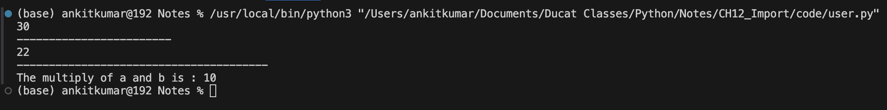

# Chapter : Import In Python

## Module:
- A module is simply a python file that we import into other python files.

### Syntax to call function from a module:

- **syntax 1:**
```
import module
module.function()
```



- **syntax 2:**
```
import module as alias
alias.function()
```


> Note: alias = temporary name of module valid for current program only.

- **syntax 3:**
```
from module import fun1,fun2,......
function1()
function2()
.
.
.
```


- **syntax 4:**
```
from module import *
function1()
function2()
.
.
.
```

> Note: This is the lesser one that is prefered by developer because it is less readable.
